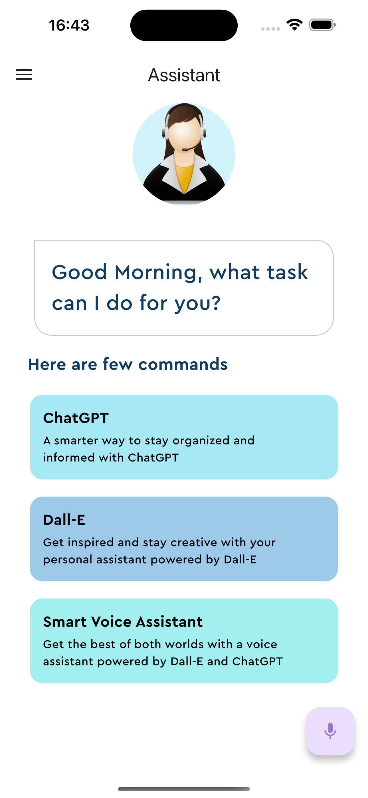

# Voice Assistant App
Voice assistant app have been to solve simple and day-to-day problems.
[reference link](https://www.youtube.com/watch?v=Q_pz4xFow3Q&list=PLlzmAWV2yTgCjoZNF3hLX3puYJir9vSQO&index=11)

## Table of Contents
- [Features](#features)
- [Screenshots](#screenshots)
- [Installation](#installation)
- [Packages used](#packages-used)

## Features
- Speech To Text/Text To Speech
- ChatGPT/Dall-E
- Network calls 

## Screenshots

## Installation
After cloning this repository go to `flutter-reddit-clone` folder. Then, follow the following steps:
- Create account in OpenAI platform
- Create your own api key (Note: api key is not free!)
- Open secrets folder in lib folder
- Open app_secrets.dart file in secrets folder and place your key
- Connect your key to your the network calls

## Packages used
- speech_to_text
- flutter_tts
- http
